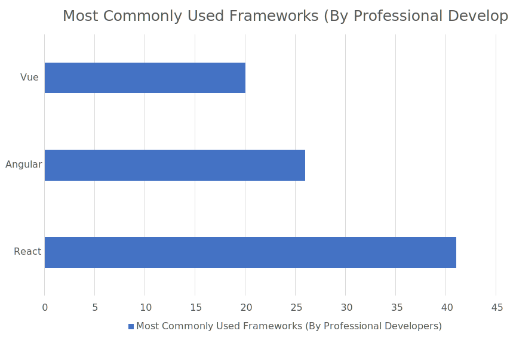

# React Study

## What is React?

[React](https://reactjs.org/) is a JavaScript library for building user interfaces

## Why React JS instead of vanilla JS?

- Vanilla JS works, but has its limitations
  - Complex: everything needs to be **imperatively written** (e.g. create, modify, and append elements; Setting classes; Setting listeners)
  - Developers have to write low-level code repeatedly

  ```JavaScript
  // e.g. in JQuery
  const $someElem1 = $('<div>');
  $someElem1.setText('Elem 1');
  $someParent.append($someElem1);

  // What if we need many of the same element? Let's create an instance again
  const $someElem2 = $('<div>');
  $someElem2.setText('Elem 2');
  $someParent.append($someElem2);

  // and again
  const $someElem3 = $('<div>');
  $someElem3.setText('Elem 3');
  $someParent.append($someElem3);

  // Writing this is longer in vanilla
  ```

- In React, UI code is broken down to small, easily maintainable building blocks called **Components**
- React is a **declarative** framework
  - Write what we want as an end result
  - React will handle the rest of the boilerplate/low-level codes

  ```JavaScript
  // Sample Element
  function SomeElem(props) {
    return (<div>{props.text}</div>);
  }
  export default SomeElem;

  // In another Component, write what we want as an end result
  <SomeElem text='Elem 1'/>
  <SomeElem text='Elem 2'/>
  <SomeElem text='Elem 3'/>

  // React will create, update the contents of, and display the above elements
  ```

  > Technically, **Elements** are the smallest building blocks of React.
  **Components** are built from combining **Elements**. For simplicity, **Components** will be used to refer to both in this document.

React allows developers to code on a 'higher level', which makes building complex UI easier

1. Define the custom elements
2. Define the end result
3. React will manage the elements to reach the end result

## Alternatives to React

- React
  - Lean and focused component-based UI library (Not much other features). Other third-party features need to be installed via external modules/libraries.
- Angular
  - Complete component-based UI framework. Includes many features. Uses TypeScript. Overkill for smaller projects.
- Vue
  - Complete component-based UI framework. Includes core features. Less popular than Angular or React.

## Popularity



Source [Stack Overflow 2021 Developer Survey](https://insights.stackoverflow.com/survey/2021#section-most-popular-technologies-web-frameworks)

